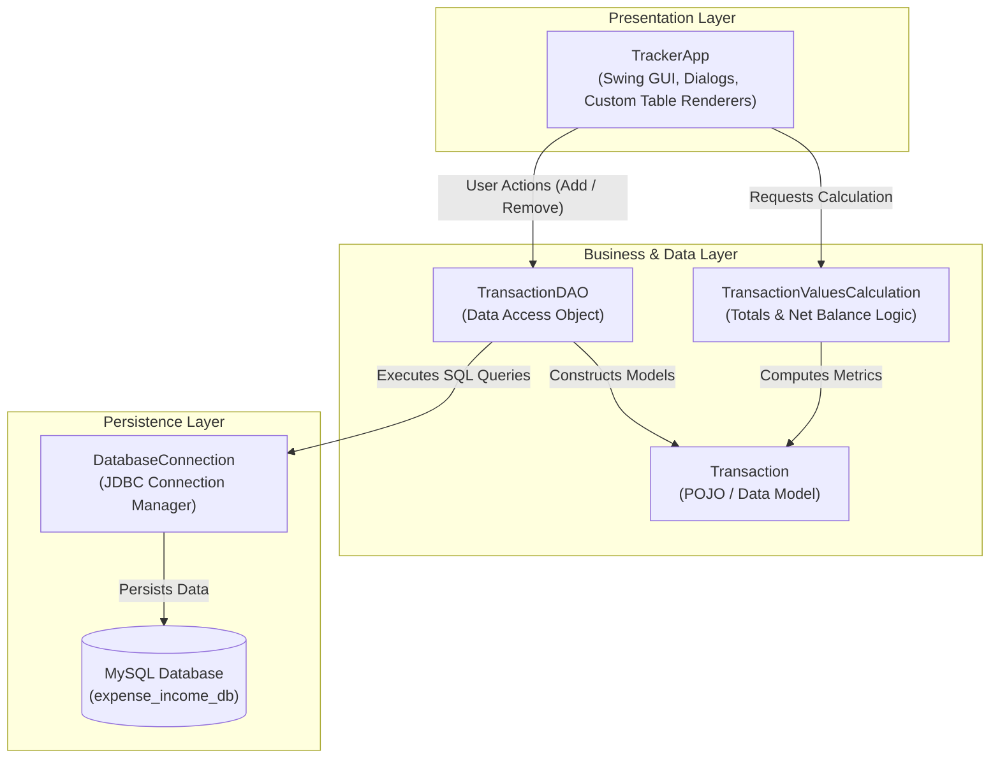

# Expense and Income Tracker

A sleek desktop Java Swing application designed to track income, manage daily expenses, and calculate net balances in real time with MySQL database persistence.

> This project was developed in 2024 as a course project for Object-Oriented Programming using Java (CSET109).

---

## Project Overview

Managing personal finances often requires a quick, distraction-free tool to log cash flow without the overhead of heavy cloud services. The **Expense and Income Tracker** provides a lightweight, responsive desktop dashboard that allows users to record daily income and expenses, monitor running financial metrics and maintain a historical ledger stored in a local relational database.

### Key Objectives:
- **Core OOP principles:** Implements encapsulation, modular architecture, separation of concerns and clean Data Access Object (DAO) design.
- **Dynamic real-time feedback:** Automatically recalculates summary cards (Total Income, Total Expense, Net Balance) as transactions are added or deleted.
- **Robust data persistence:** Uses JDBC to store transactions reliably in MySQL, persisting records across application restarts.
- **Polished custom UI:** Provides an undecorated, modern user interface with custom draggable frames, gradient components and colour-coded data visualisation.

---

## How It Works

The application follows a modular 3-tier architecture with clean separation between the user interface, business calculations and database access.

### Architecture Diagram



### Application Data Flow:
1. **Startup:** `TrackerApp` initialises the GUI, requests all transaction records via `TransactionDAO`, computes current metrics via `TransactionValuesCalculation`, and displays the formatted summary cards and data table.
2. **Adding a transaction:**
   - The user opens the Add Dialog, enters description and amount and selects the transaction type (Income or Expense).
   - Input is validated, and a `PreparedStatement` inserts the record into MySQL.
   - The summary cards and transaction table instantly re-render with updated values and continuous `#` row numbering.
3. **Removing a transaction:**
   - The user selects a row and clicks Remove.
   - The app retrieves the hidden database ID, deletes the record from MySQL and immediately recalculates running totals and refreshes the ledger.

---

## Features

- **Dashboard summary cards:**
  - **Expense:** Real-time total expenses formatted in Indian Rupees (₹).
  - **Income:** Real-time total income received.
  - **Total Balance:** Dynamic net balance calculation (`Income - Expenses`) with a negative indicator when in deficit.
- **Transaction management:**
  - Add new transactions (Income or Expense) with descriptions and amounts.
  - Remove existing transactions with instant dynamic recalculation.
  - Input validation to ensure clean numerical data entry.
- **Custom modern Swing UI:**
  - Undecorated window with custom draggable title bar and window controls.
  - Gradient table headers and custom-styled scrollbars.
  - Colour-coded rows (Green for Income, Red for Expense).
  - Dynamic `#` row numbering decoupled from database primary keys.
- **Database persistence:**
  - Built using JDBC with MySQL database integration.
  - Uses the Data Access Object (DAO) design pattern for clean separation of concerns.

---

## Tech Stack

- **Language:** Java (JDK 17+ or JDK 21)
- **GUI framework:** Java Swing and AWT
- **Database:** MySQL (via XAMPP / WAMP / Standalone MySQL)
- **Connectivity:** JDBC (`mysql-connector-j-8.3.0.jar`)
- **Architecture:** 3-Tier Architecture / DAO Pattern

---

## Project Structure

```text
Java Project - Expense Tracker/
├── lib/
│   └── mysql-connector-j-8.3.0.jar       # MySQL JDBC Driver
├── src/
│   ├── DatabaseConnection.java           # JDBC Connection Manager
│   ├── TrackerApp.java                   # Main UI & Application Logic
│   ├── Transaction.java                  # Transaction Model Entity
│   ├── TransactionDAO.java               # Database Access Object
│   └── TransactionValuesCalculation.java # Utility for Financial Calculations
├── schema.sql                            # MySQL Database Schema Setup
├── .gitignore
├── LICENSE
└── README.md
```

---

## Getting Started

### 1. Prerequisites
- **Java Development Kit (JDK):** Java 17 or higher.
- **MySQL Server:** Installed via [XAMPP](https://www.apachefriends.org/), WAMP, or standalone MySQL.
- **IDE:** [VS Code](https://code.visualstudio.com/) or [IntelliJ IDEA](https://www.jetbrains.com/idea/).

---

### 2. Database Setup

1. Start **Apache** and **MySQL** in your **XAMPP Control Panel**.
2. Open **phpMyAdmin** (`http://localhost/phpmyadmin`) or your MySQL terminal.
3. Import the [`schema.sql`](schema.sql) file or run the following SQL query:

```sql
CREATE DATABASE IF NOT EXISTS `expense_income_db`;
USE `expense_income_db`;

CREATE TABLE IF NOT EXISTS `transaction_table` (
    `id` INT AUTO_INCREMENT PRIMARY KEY,
    `transaction_type` VARCHAR(50) NOT NULL,
    `description` VARCHAR(255) NOT NULL,
    `amount` DOUBLE NOT NULL
) ENGINE=InnoDB DEFAULT CHARSET=utf8mb4;
```

4. If your MySQL server has a root password, configure it in [`src/DatabaseConnection.java`](src/DatabaseConnection.java):
```java
private static final String USER = "root";
private static final String PASSWORD = ""; // Update if password is set
```

---

### 3. How to Run

#### Option A: Running in VS Code
1. Open the project folder in VS Code.
2. Install the **Extension Pack for Java** (if not already installed).
3. Open `src/TrackerApp.java` and click **Run** above the `main` method (or press **`F5`**).

#### Option B: Running in IntelliJ IDEA
1. Open the project in IntelliJ IDEA.
2. Ensure the MySQL Connector JAR in `lib/` is added as a module dependency (**File** -> **Project Structure** -> **Modules** -> **Dependencies**).
3. Open `src/TrackerApp.java` and click the **green Play button** next to the `main` method.

#### Option C: Running from Command Line (Terminal / PowerShell)
```powershell
# Compile
javac -cp "lib/*;src" -d out src/*.java

# Run
java -cp "out;lib/*" TrackerApp
```

---

## License

This project is open-source and available under the [MIT License](LICENSE).
